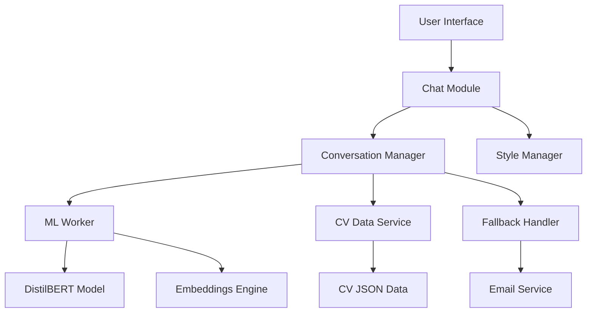
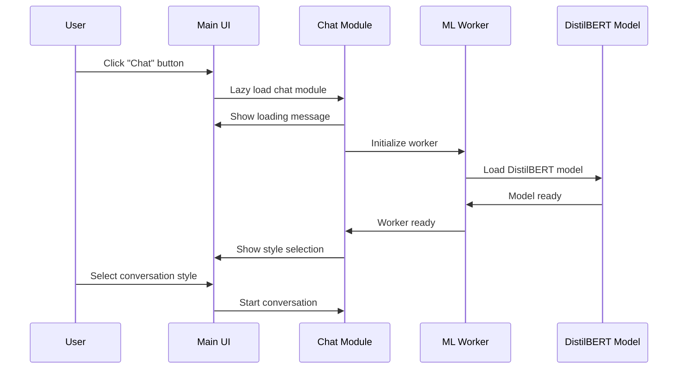
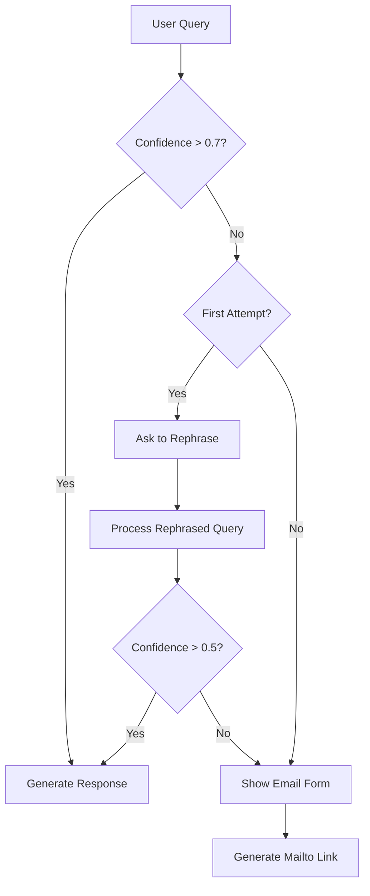

# Design Document

## Overview

The chat-bot feature implements an intelligent CV assistant that runs entirely in the browser using DistilBERT for semantic understanding. The system follows a modular architecture with lazy-loaded components, Web Workers for ML processing, and a clean separation between UI, business logic, and ML operations. The design prioritizes performance, privacy, and maintainability while integrating seamlessly with the existing vanilla JS/SCSS architecture.

## Architecture

### High-Level Architecture



### Component Hierarchy

1. **UI Layer**: Chat interface, loading states, style selection
2. **Business Logic Layer**: Conversation management, context handling, response generation
3. **ML Processing Layer**: Web Worker with DistilBERT, semantic matching
4. **Data Layer**: CV data, embeddings, conversation history
5. **Integration Layer**: Email fallback, browser compatibility checks

### Module Loading Strategy



## Components and Interfaces

### 1. Chat Module (`src/scripts/modules/chat-bot.cjs`)

**Primary Interface:**
```javascript
class ChatBot {
  async initialize()
  async selectConversationStyle(style)
  async processMessage(message)
  async restartConversation()
  destroy()
}
```

**Responsibilities:**
- Lazy loading coordination
- UI state management
- Worker communication
- Error handling and fallbacks

### 2. ML Worker (`src/scripts/workers/chat-ml-worker.js`)

**Worker Interface:**
```javascript
// Messages to worker
{
  type: 'initialize',
  modelPath: string,
  cvData: object
}

{
  type: 'process_query',
  message: string,
  context: array,
  style: string
}

// Messages from worker
{
  type: 'ready',
  success: boolean
}

{
  type: 'response',
  answer: string,
  confidence: number,
  matchedSections: array
}
```

**Responsibilities:**
- DistilBERT model loading and management
- Semantic similarity computation
- Embedding generation and matching
- Response template processing

### 3. Conversation Manager (`src/scripts/modules/conversation-manager.cjs`)

**Interface:**
```javascript
class ConversationManager {
  addMessage(message, response)
  getContext(limit = 5)
  clearHistory()
  setStyle(style)
  generateResponse(query, cvMatches, style)
}
```

**Responsibilities:**
- Conversation history management
- Context window maintenance
- Response style application
- Template-based response generation

### 4. CV Data Service (`src/scripts/modules/cv-data-service.cjs`)

**Interface:**
```javascript
class CVDataService {
  async loadCVData()
  getEmbeddings(section)
  findRelevantSections(query, threshold = 0.7)
  formatResponseData(sections, style)
}
```

**Responsibilities:**
- CV data loading and caching
- Pre-computed embeddings management
- Section matching and ranking
- Data formatting for responses

### 5. UI Components

**Chat Interface (`src/scripts/modules/chat-ui.cjs`):**
```javascript
class ChatUI {
  showLoadingState()
  showStyleSelection()
  showChatInterface()
  addMessage(message, isUser)
  showTypingIndicator()
  showError(message)
  showFallbackForm()
}
```

## Data Models

### CV Data Structure

```javascript
// src/data/cv-data.json
{
  "metadata": {
    "version": "1.0",
    "lastUpdated": "2024-01-01",
    "totalSections": 25
  },
  "sections": {
    "experience": {
      "react": {
        "id": "exp_react",
        "keywords": ["react", "reactjs", "jsx", "hooks", "components"],
        "embeddings": [0.1, 0.2, ...], // Pre-computed DistilBERT embeddings
        "responses": {
          "hr": "Serhii has 3+ years of professional React development experience, having built 15+ production applications with modern React patterns including hooks, context API, and performance optimization techniques.",
          "developer": "I've been working with React for 3+ years now. Really love the hooks ecosystem and functional components. Built everything from simple portfolios to complex e-commerce platforms with React.",
          "friend": "Oh React! 🚀 That's definitely one of my favorite frameworks to work with. Been coding with it for 3+ years and still get excited about new features. The component-based thinking just clicks with me!"
        },
        "details": {
          "years": 3,
          "projects": ["E-commerce Platform", "Portfolio Website", "Task Management App"],
          "skills": ["Hooks", "Context API", "Redux", "React Router", "Testing Library"],
          "achievements": ["Improved app performance by 40%", "Mentored 2 junior developers"]
        },
        "relatedSections": ["javascript", "typescript", "frontend"]
      }
    },
    "skills": {
      "javascript": {
        "id": "skill_js",
        "keywords": ["javascript", "js", "es6", "es2020", "vanilla"],
        "embeddings": [0.3, 0.1, ...],
        "responses": {
          "hr": "Serhii possesses advanced JavaScript skills with 5+ years of experience in modern ES6+ development, including async/await, modules, and performance optimization.",
          "developer": "JavaScript is my bread and butter - 5+ years of experience with everything from vanilla JS to modern frameworks. Love working with ES6+ features and async patterns.",
          "friend": "JavaScript is like my native language at this point! 😄 Been writing it for 5+ years and still discover cool new tricks. From vanilla DOM manipulation to complex async workflows."
        },
        "details": {
          "years": 5,
          "level": "advanced",
          "specialties": ["Async Programming", "DOM Manipulation", "Performance Optimization"],
          "frameworks": ["React", "Vue", "Node.js"]
        }
      }
    },
    "projects": {
      "portfolio": {
        "id": "proj_portfolio",
        "keywords": ["portfolio", "website", "personal", "showcase"],
        "embeddings": [0.2, 0.4, ...],
        "responses": {
          "hr": "Serhii's portfolio website demonstrates his technical skills through a performance-optimized static site built with vanilla JavaScript, SCSS, and modern build tools.",
          "developer": "This portfolio site you're looking at! Built it with vanilla JS and SCSS to keep things lightweight and fast. Includes a translation system and responsive design.",
          "friend": "You're actually looking at one of my favorite projects right now! 😊 Built this whole portfolio from scratch with vanilla JS because I wanted to prove you don't always need a framework."
        },
        "details": {
          "technologies": ["Vanilla JavaScript", "SCSS", "HTML5", "Node.js"],
          "features": ["Multi-language support", "Responsive design", "Performance optimized"],
          "metrics": ["<2s load time", "100% accessibility score"]
        }
      }
    }
  },
  "personality": {
    "traits": ["curious", "problem-solver", "collaborative", "detail-oriented"],
    "interests": ["clean code", "user experience", "performance optimization", "new technologies"],
    "communication_style": {
      "hr": "professional, structured, achievement-focused",
      "developer": "technical, collaborative, solution-oriented",
      "friend": "casual, enthusiastic, story-telling"
    }
  }
}
```

### Conversation Context Model

```javascript
{
  "sessionId": "uuid",
  "style": "developer|hr|friend",
  "history": [
    {
      "timestamp": "2024-01-01T10:00:00Z",
      "userMessage": "Do you have React experience?",
      "botResponse": "I've been working with React for 3+ years...",
      "matchedSections": ["experience.react"],
      "confidence": 0.95
    }
  ],
  "context": {
    "lastTopics": ["react", "javascript"],
    "userPreferences": {},
    "conversationFlow": "technical_discussion"
  }
}
```

## Error Handling

### Error Categories and Responses

1. **Model Loading Errors**
   - Network issues: "Having trouble downloading my brain 🧠 Check your connection?"
   - Browser compatibility: "Oops, sorry, we couldn't load Serhii to your browser :("
   - Memory constraints: "Your device needs a bit more memory to run me properly"

2. **Query Processing Errors**
   - Low confidence matches: Trigger rephrase request
   - No matches found: Activate fallback flow
   - Processing timeout: "Give me a moment to think about that..."

3. **Worker Communication Errors**
   - Worker crash: Attempt restart, fallback to simple responses
   - Message timeout: Show processing indicator, retry mechanism
   - Invalid responses: Log error, ask user to rephrase

### Fallback Strategy



## Testing Strategy

### Unit Testing Approach

1. **CV Data Service Tests**
   - Data loading and validation
   - Embedding computation accuracy
   - Section matching algorithms
   - Response formatting

2. **Conversation Manager Tests**
   - Context window management
   - History persistence
   - Style application
   - Template rendering

3. **ML Worker Tests**
   - Model loading simulation
   - Query processing accuracy
   - Error handling scenarios
   - Performance benchmarks

### Integration Testing

1. **End-to-End Conversation Flow**
   - Style selection → Query → Response cycle
   - Context preservation across messages
   - Fallback activation and email generation
   - Worker communication reliability

2. **Performance Testing**
   - Model loading time measurement
   - Query processing latency
   - Memory usage monitoring
   - Browser compatibility validation

### Browser Testing Matrix

| Browser | Version | WASM Support | Worker Support | Status |
|---------|---------|--------------|----------------|---------|
| Chrome | 90+ | ✅ | ✅ | Primary |
| Firefox | 88+ | ✅ | ✅ | Primary |
| Safari | 14+ | ✅ | ✅ | Secondary |
| Edge | 90+ | ✅ | ✅ | Secondary |

### Performance Benchmarks

- **Model Loading**: < 30 seconds on 3G connection
- **Query Processing**: < 3 seconds average response time
- **Memory Usage**: < 200MB peak usage
- **Bundle Size**: < 70MB total (model + code)

## Security and Privacy Considerations

### Data Privacy
- All processing occurs client-side
- No conversation data sent to external servers
- Session data cleared on page close
- Session data alive for 1 hour
- Email fallback uses mailto (no server storage)

### Content Security
- Sanitize all user inputs before processing
- Validate CV data structure on load
- Implement rate limiting for query processing
- Secure worker message validation

### Browser Security
- Use Content Security Policy headers
- Validate worker script integrity
- Implement proper error boundaries
- Secure model file serving

## Performance Optimization

### Loading Optimization
- Progressive model loading (tokenizer first, then weights)
- Compression for model files (gzip/brotli)
- CDN delivery for model assets
- Lazy loading of non-critical components

### Runtime Optimization
- Embedding caching for repeated queries
- Context window size management
- Worker thread pooling (if needed)
- Memory cleanup on conversation restart

### Bundle Optimization
- Tree shaking for unused Transformers.js features
- Code splitting for chat module
- Async loading of ML dependencies
- Minification and compression

## Integration Points

### Existing Portfolio Integration
- Seamless integration with current navigation
- Consistent styling with existing SCSS architecture
- Translation system compatibility
- Build process integration

### Future Enhancement Hooks
- Analytics integration points
- A/B testing framework compatibility
- Performance monitoring integration
- User feedback collection system